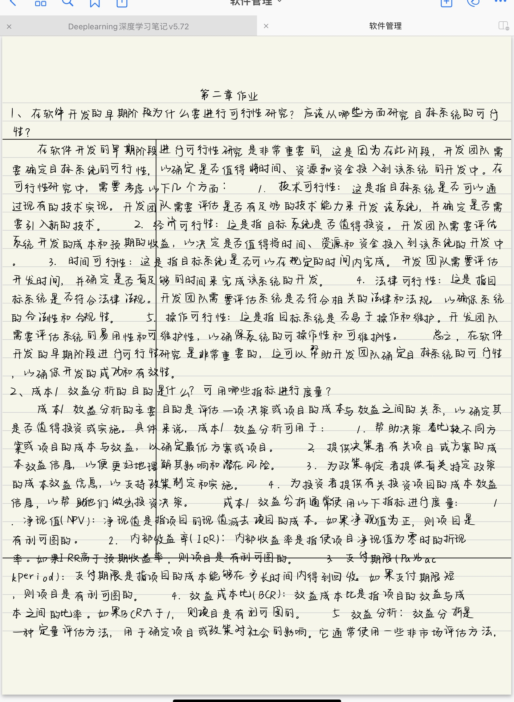

# GPText2handwrite
手写作业好无聊
能把 $txt$ 文档里的文本( $particularly$ $Chinese$ )转为手写体，并将结果以照片格式输出的小工具
添加openai的api进行调用来作为文本类作业的辅助措施

## 使用用例
```bash
git clone git@github.com:eddiehsu66/GPText2handwrite.git
```
然后
```bash
cd GPText2handwrite
```
运行
```python
pip install -r requirements.txt #下载相关的包
cd app
python handwriting.py
```

##  相关文件说明
text.txt:装的是你要转为手写体的文件
resource:放置手写体文件$ttf$，以及背景图片$model1.jpg$
result:放置生成结果

### 具体效果如下：



### 备注
handwriting.py实现方式借鉴于一个陌生朋友，不过当时仅仅是clone而没有fork,qaq
